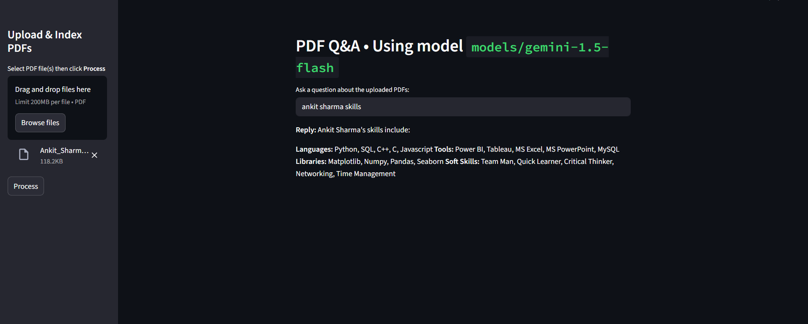

# 📄 Chat With PDF using Gemini 1.5 (LangChain + Streamlit)

> Upload any PDF and ask questions using Google's Gemini 1.5 models (like Flash/Pro). Built with LangChain, FAISS, and Streamlit. Uses semantic search and LLM to answer your queries from PDFs.



---

## 🚀 Features

- 📄 Upload one or more PDF files
- ✂️ Auto extract & chunk PDF text
- 📚 Create vector store using `models/embedding-001`
- 💬 Ask natural language questions
- ⚡ Powered by Gemini 1.5 (Flash/Pro)
- 🔐 Local secure: your API key never leaves machine

---

## 🛠️ Tech Stack

| Component     | Technology                 |
|---------------|----------------------------|
| LLM           | Google Gemini 1.5 (Flash)  |
| Embeddings    | `models/embedding-001`     |
| Framework     | Streamlit + LangChain      |
| Text parsing  | PyPDF2                     |
| Vector DB     | FAISS                      |

---

## ▶️ How to Run

### 1️⃣ Clone this repo

```bash
git clone https://github.com/ankitsharmaa29/ChatWithPDF.git
cd chat-with-pdf
